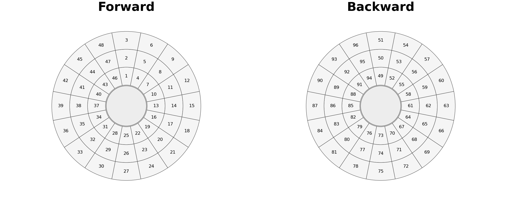
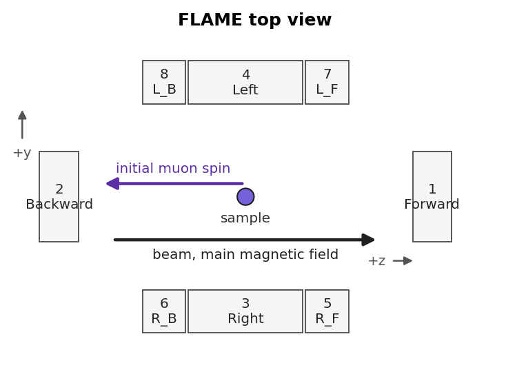
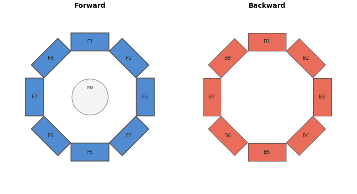
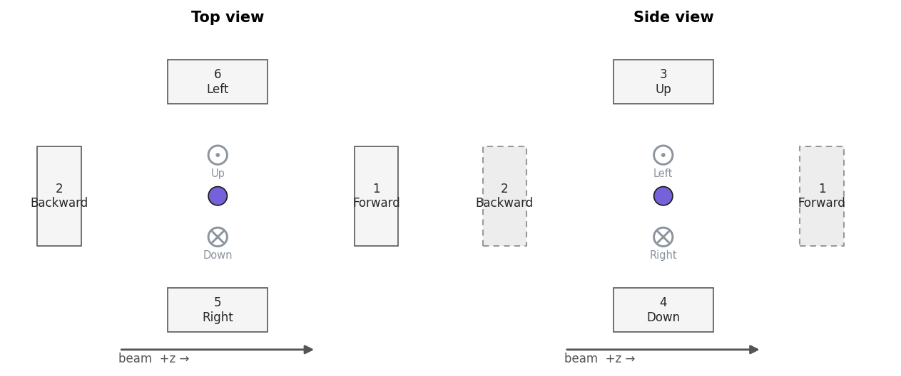

Detector Grouping and Layout
============================

Detector grouping defines how the raw per-detector count histograms are
combined into the forward and backward sums that enter the asymmetry
formula. The choice is dictated by the experiment: a coarse two-group
arrangement is right for ordinary asymmetry analysis on a longitudinal
spectrometer; keeping detectors as individual groups is what enables the
per-detector amplitudes and phases needed for a paramagnetic Knight-shift
measurement (:doc:`grouped_time_domain_fitting`); and a vector-polarisation
experiment needs distinct pairs assigned to :math:`P_x`, :math:`P_y`, and
:math:`P_z` (:doc:`vector_polarization`). For new data from any of the
supported instruments — ISIS HiFi, MuSR, EMU and the PSI FLAME, HAL-9500 and
GPS spectrometers — the matching preset in the Detector Layout editor seeds
sensible defaults that can then be refined graphically before being applied.

Grouping is configured from the **Grouping** window and edited graphically
with the **Detector Layout** editor. This page covers both, together with the
grouping-profile model that stores the settings, the per-format (PSI/ROOT)
details, and the beam-vs-analysis naming conventions. For a hands-on
walkthrough with a worked calibration, see :doc:`grouping_calibration`.

Grouping profiles
------------------

A grouping profile is a **named, project-level record of the shareable
grouping settings for one instrument** — the detector groups, which pair
is forward/backward, the :math:`\alpha` policy, and the deadtime, background,
binning and period settings. It excludes anything that is a fact about an
individual run rather than a shared analysis choice: :math:`t_0`, the
good-bin window, per-detector deadtime read from a file, and period tables
stay with the run.

This split solves a real problem. Every run used to carry its own complete
grouping payload, so recalibrating :math:`\alpha` after loading a fifth run
in a series meant editing it a fifth time — and nothing stopped two runs of
the same series from silently drifting apart. A profile fixes the shareable
choices in one place: edit it once, and every run that matches it is
analysed the same way.

Instrument and scope
~~~~~~~~~~~~~~~~~~~~~~

A profile applies to every run of one **instrument** — matched, internally, on
the pair ``(instrument, histogram count)``. The histogram count disambiguates
layout variants of the same physical instrument, such as PSI GPS's
six-detector PSI-BIN export and eleven-detector MusrRoot export (see `PSI GPS`_
below): both are shown as one instrument, but a GPS PSI-BIN profile is never
offered to an eleven-detector GPS ROOT run. The window names the instrument
plainly — "GPS" — and appends the detector count only when two variants of the
same instrument are both loaded, so they can be told apart: "GPS (6 detectors)"
and "GPS (11 detectors)".

A project may hold several saved profiles per instrument (a "silver
calibration" profile and a "custom two-group" profile for the same
instrument, say), but only one is **active** at a time. A newly loaded run
inherits its instrument's active profile automatically — no per-run Apply
step is needed. Switching which profile is active re-resolves every run of
that instrument against the new profile the next time it is displayed or
reduced.

Because a run's instrument is a fact about its data rather than a user
preference, a **stale persisted instrument identity self-heals on reload**: if a
project saved the wrong instrument for a run (for example, a FLAME run stored as
"GPS" by an older version), re-detection from the freshly loaded file overrides
the stored value, the run is re-matched to the correct instrument's profile (or
kept on the loader defaults if none exists), and the mismatched preset's group
names are discarded. Saved profiles themselves are never altered — only runs
heal.

A run can be explicitly **released** from its profile, freezing its current
grouping as a per-run override that further profile edits do not touch. The
Data Browser marks a released run with a trailing **⊗** and the tooltip
"Custom grouping — this run is released from its grouping profile." A
released run can later be **reattached**, dropping the override so it
inherits the active profile again. Release and reattach are both driven from
the Grouping window's scope panel (`The Grouping window`_ below).

Alpha, deadtime, and background policies
~~~~~~~~~~~~~~~~~~~~~~~~~~~~~~~~~~~~~~~~~

A profile stores each of its three corrections as a **policy** — a mode plus
whatever value the mode needs — rather than a bare value, so the provenance
of the number survives:

* **Alpha policy** — ``fixed`` applies the same value to every run;
  ``calibrated`` applies a value measured once (with a recorded method and
  source run, e.g. "diamagnetic · run 2923"); ``per_run_estimate`` computes
  each run's own forward/backward integral ratio at resolution time (Mantid's
  ``AlphaCalc``; the PSI ``.bin`` default), so a series with detector
  sensitivities that drift run-to-run stays self-consistent without a shared
  number.
* **Deadtime policy** — ``off`` disables the correction; ``from_file`` reads
  each run's own file deadtime values; ``manual`` applies a stored
  per-detector table (hand-typed or fitted with **Cal**); ``estimate``
  applies one fitted value to every detector.
* **Background policy** — ``none``, ``range`` (a pre-:math:`t_0` window),
  ``tail_fit`` (a late-time Poisson fit), ``reference_run`` (a dedicated
  background run), or ``fixed`` (constant forward/backward values). See
  `Background Correction`_ below for the maths each mode applies.

Resolving a profile against a run merges these policies with the run's own
file-derived facts to produce exactly the same grouping payload shape used
before profiles existed, so nothing downstream — reduction, fitting, export —
had to change to support them. The reduction itself funnels through one
function, :func:`asymmetry.core.transform.reduce.reduce_grouped_asymmetry`,
which applies deadtime correction, groups the histograms onto a common
:math:`t_0`, optionally subtracts background, and forms the counts-then-ratio
asymmetry — the same order the Grouping window's live preview and the main
reduction path both use, so what you see while editing is what you get after
Apply.

Migration from older projects
~~~~~~~~~~~~~~~~~~~~~~~~~~~~~~

Projects saved before profiles existed (schema v11 and earlier) store a
complete grouping payload on every dataset. Opening such a project migrates
it to schema v12 automatically: datasets are grouped by instrument, and
within each instrument

* if every run's *shareable* settings already agree, one active profile named
  "Default (<instrument>)" is created and every contributing run switches
  from its own payload to a reference to that profile;
* if the shareable settings disagree, a profile is built from the majority
  payload; runs matching it inherit the profile, and the remaining,
  genuinely divergent runs keep their per-run payload untouched, exactly as
  a manually released run would.

The migration is additive: nothing that could not be faithfully represented
as a profile is discarded, and a run whose instrument cannot be
identified (missing instrument metadata) is left with its original payload and
joins no profile. Saving the project afterwards writes schema v12.

The Grouping window
--------------------

.. figure:: /_generated/screenshots/grouping_window_profile_editor.png
   :width: 100%
   :alt: Grouping window profile editor with its live asymmetry preview pane.

   The Grouping window's profile editor, with the scope panel on the left and
   the live forward/backward asymmetry preview along the bottom.

Open it with the **Grouping** button on the main toolbar (or
**Analysis → Grouping…**). Where the old dialog operated on a reference run
and broadcast settings to whichever datasets were checked, the window is now
a **profile editor**: it edits one profile's settings in a draft, and that
draft is what gets applied to every run inheriting the profile.

* **Profile selector** — switches which saved profile is being edited, and
  offers **New…** and **Duplicate…** to start a fresh profile or branch one
  from the current settings. Only profiles for the selected instrument are
  listed. Renaming is available from the same control.
  Switching away from a profile with unsaved edits prompts to discard them.
* **Instrument switcher** ("Instrument") — chooses which instrument's profile
  the window edits, listing every instrument present in the loaded datasets as
  "GPS — 3 runs". It is hidden when the project holds a single instrument, since
  there is then nothing to switch between. Picking another instrument swaps the
  whole editor — its draft, selected run, scope panel, and preset list all
  follow — after the same discard prompt the profile selector uses for unsaved
  edits.
* **Scope panel — the selector.** Headed "Runs of this instrument", it lists the
  runs of the selected instrument, each tagged either **inherits <profile>** or
  **override**, with **Release** and **Reattach** buttons to move a run between
  the two. The run **selected** here is the one the form previews and edits:
  selecting a run shows that run's effective settings in the form, drives the
  live preview, and seeds the status rows with its per-run facts
  (:math:`t_0`, good-bin window, file deadtime, period tables). What your edits
  change follows the selected run's status (`Editing target follows selection`_
  below). Apply is disabled only when every run has been released *and* no
  override has pending edits, since there would then be nothing left to commit.
* **Editing-target strip** — directly above the form, a persistent strip states
  what your edits currently apply to: accent-tinted **"Editing profile '<name>'
  — applies to N runs"** while an inheriting run is selected, or warning-tinted
  **"Editing override for run N — this run only"** while an overridden run is
  selected. The same tint highlights the selected row in the scope list, and a
  run with uncommitted override edits gains an **"override *"** marker there.
* **Preset dropdown and chip** — an instrument-aware preset dropdown seeds a
  sensible starting arrangement (see the per-instrument sections below), and
  a chip beside it reads either **"Preset: <name>"** when the draft's groups
  still match that preset exactly, or **"Custom (edited from <name>)"** the
  moment any group, name, or forward/backward assignment is edited by hand.
  This comparison is re-made every time the draft changes rather than cached,
  so the chip never keeps showing a preset name the settings have since
  drifted away from.
* **Live asymmetry preview** — a debounced plot of the forward/backward
  asymmetry the current draft would produce on the selected run, recomputed
  automatically as groups, :math:`\alpha`, binning, deadtime, or background
  settings change. The recompute runs on a worker thread (never the GUI
  thread), so editing stays responsive even while a reduction is in flight;
  a superseded recompute is discarded in favour of the latest edit.
* **Tabbed settings** — the right pane is split into two tabs, **Grouping and
  timing** (groups, the :math:`\alpha` value and its provenance, t0, binning,
  exclusions, periods) and **Corrections** (deadtime, background, and
  :math:`\alpha` calibration, each previewed against the same corrected reduction),
  with the live preview pinned below both. Splitting them keeps the corrections a
  first-class, named destination rather than the foot of one long scroll. When a
  calibrated :math:`\alpha` goes stale (the deadtime or background settings changed
  since it was measured), the **Corrections** tab is marked with a ⚠ so the change
  is discoverable from the Grouping tab. The :math:`\alpha` section carries a
  one-line provenance summary (e.g. "α = 1.2345(67) · Diamagnetic (TF) · run
  2923"); deadtime and background carry their own mode controls and one-line
  status (see `Alpha calibration`_, `Deadtime Correction`_, and
  `Background Correction`_ below).

Editing never touches a saved profile or run until you press **Apply**.
**Apply commits everything you have changed in one pass** — the profile to
every inheriting run, plus each edited override to its own run. When any
override has pending edits the button names the blast radius, e.g. **"Apply
(profile + 2 overrides)"**. Switching selection between runs never prompts:
each target keeps its own draft, so you can move freely between the profile and
several overrides and edit each in turn. The only guard is closing the window
with uncommitted changes, which prompts and lists exactly what would be lost —
e.g. "profile 'Default (GPS)' and overrides for runs 12, 15".

Applying reports, in the LOG and the status bar, how many runs the profile
reached and which overrides were updated. A grouping may name detectors a run
does not contain — a full instrument preset applied to a file exporting only
some of the instrument's detectors. The forward/backward groups then reduce
over the detectors that are present (matching the dialog preview), and the LOG
notes which absent detectors were ignored. Only when a forward or backward
group has *none* of its detectors in the run — so no asymmetry can be formed —
is that run skipped, and the report names the missing detectors and the run's
detector count so the mismatch is diagnosable rather than a silent no-op.

The grouping payload stores:

* detector groups (1-based detector IDs)
* per-group include flags for grouped plotting and grouped fitting
* group names
* selected forward/backward groups
* alpha and bin-range settings
* instrument and preset metadata
* optional per-detector ``t0`` metadata for formats such as PSI BIN/MDU and
  MusrRoot/LEM ROOT
* the time-zero policy (``from_file``, ``manual``, or ``auto_detect``); a
  manual/detected shift is carried as ``effective_detector_t0_bins`` so the
  raw histograms are never rewritten (see `Time-zero (t0) modes`_)
* optional deadtime metadata: ``deadtime_mode``, ``deadtime_method``, and any
   resolved ``dead_time_us`` values used for manual, calibrated, or estimated
   deadtime correction
* optional background metadata: ``background_correction``,
  ``background_ranges``, ``background_values``, and ``background_method``

These settings are persisted in project files, as grouping profiles (schema
v12), and in instrument presets.

.. _Editing target follows selection:

Editing target follows selection
~~~~~~~~~~~~~~~~~~~~~~~~~~~~~~~~~~

There is no separate "mode" for editing a per-run override: the editing target
simply follows whichever run you select in the scope panel.

* **Select an inheriting run** and you are editing the **profile** — the strip
  above the form reads "Editing profile '<name>' — applies to N runs" in the
  accent colour, and your edits go to the profile draft.
* **Select an overridden run** and you are editing **that run's own override** —
  the strip reads "Editing override for run *N* — this run only" in the warning
  colour, the form seeds from the run's own grouping, and your edits go to a
  separate override draft that never touches the profile.

Nothing is disabled: the profile and Instrument switchers stay active while an
overridden run is selected. Changing the profile (or instrument) is a
profile-scope action, so if an overridden run is selected the window first
switches the selection to an inheriting run of the current instrument (keeping
your override draft intact); if every run has been released there is no profile
to edit and the change is refused.

Override drafts **accumulate** across a session: switching selection between the
profile and one or more overridden runs never prompts, and each keeps its own
in-progress edits. A run with uncommitted override edits shows an "override *"
marker in the scope list. **Apply** commits everything at once — the profile to
its inheriting runs and every edited override to its own run — and the status
bar names both parts. Each edited run stays marked overridden (the edit *is* its
new override).

To create an override, **Release** a run; releasing the currently selected run
immediately flips the editing target to a fresh override draft seeded from that
run's current effective settings. To drop one, **Reattach** it; reattaching a
run whose override draft has uncommitted edits prompts to discard them first.
The window's close guard covers every uncommitted change — the profile draft and
all dirty overrides — so nothing is lost silently.

Period mode controls
---------------------

A two-period reference run (ISIS red/green period histograms) shows an
additional **RG Mode** control in the Grouping window: red, green,
green-minus-red, or green-plus-red. This row is hidden for every other run —
it only appears once the currently selected run actually carries two
period histograms — so it never clutters the window for ordinary
single-period data.

Time-zero (t0) modes
--------------------

The **t0 Bin** row carries a mode selector that decides where each run's
analysis time-zero comes from. This mirrors WiMDA's *FileValues* checkbox on
the grouping panel: with it ticked the header t0 and good-bin values are used
and the manual controls are disabled; unticked, your own values apply.

* **From file** (the default) — every run uses its own file-derived t0. All
  loaders already read t0 verbatim from the file header (PSI per-detector
  ``nt0``, MusrRoot ``DetectorInfo``, NeXus ``time_zero``), and the common t0
  is the maximum over the analysis groups, so per-detector values are
  preserved and each run is aligned by its own time-zero. The spinbox is
  read-only and shows the selected run's resolved t0; switching the selected run
  updates it. Nothing is stored on the profile — resolution reads each run's
  file again.
* **Manual** — type a common t0 override. It is applied to every run of the
  profile as an *offset*: the difference between your value and the run's file
  common t0 is added to each detector's own file t0. Crucially this is
  non-destructive — the run's loaded histograms keep their file-derived t0, and
  the shift lives only in the resolved grouping (so an override can be changed
  or cleared without re-loading the data). **Find t0** is the one-shot fill for
  this mode: it runs the search on the selected run and drops the result into the
  spinbox for you to confirm.
* **Auto-detect** — run the t0 search on *every* run at reduction time (the
  prompt-peak maximum at continuous sources, the pulse-edge midpoint at pulsed
  sources). The spinbox is read-only and shows the selected run's detected value
  with its provenance (strategy and detector spread); each run resolves its own
  detected t0.

The *t_good* offset and last-good-bin controls are per-run facts and are
unaffected by the t0 mode — a manual or detected t0 shift carries the good
window with it so the offset from t0 stays fixed.

Alpha calibration
------------------

.. figure:: /_generated/screenshots/alpha_calibration_dialog.png
   :width: 80%
   :align: center
   :alt: The inline alpha calibration controls in the grouping window's
      Corrections tab — a highlighted transverse-field calibration run, a
      method combo, an Estimate α button, and the shared before/after preview.

   Alpha is calibrated inline, in the **α (detector balance)** section of the
   Corrections tab: pick the calibration run, choose a method, and press
   **Estimate α**. The shared live preview below doubles as the before (α = 1)
   / after (fitted α) comparison once α is calibrated.

Alpha is calibrated inline, in the **α (detector balance)** section of the
Corrections tab. Pick a run from the **Calibration run** dropdown — every run
of the current instrument is listed, with likely calibration candidates
highlighted and auto-selected: a run is flagged when its metadata carries
explicit transverse-field evidence (a structured ``Transverse`` field-geometry
classification, or a ``TF``/``wTF``/``transverse`` token in the title or
comment) and, when a field magnitude is recorded, that magnitude sits in the
weak-to-moderate window a diamagnetic calibration run conventionally occupies
(roughly 5–500 G). A run with an explicit transverse token but no recorded
field magnitude is still flagged, since the token is the stronger signal; a
field magnitude alone, with no textual evidence, is not — the value alone is
ambiguous between a weak-TF calibration run and a run whose only relation to the
window is coincidence. This heuristic only changes what is highlighted and
pre-selected: any loaded run remains choosable from the dropdown.

Choose a **Method** from three options:

* **Diamagnetic (TF)** — the standard balance method for a silver or other
  non-relaxing transverse-field run: :math:`\alpha` is fitted so the forward
  and backward precession signals oscillate symmetrically about zero.
* **General (LF/ZF)** — a fit that also accommodates a genuinely relaxing or
  multi-component signal.
* **Count ratio ΣF/ΣB** — the simple forward/backward integral ratio over the
  good-bin window (Mantid's ``AlphaCalc``), with no oscillation model.

Press **Estimate α**. The estimate runs on a worker thread over the *corrected*
forward/backward counts — deadtime-corrected and background-subtracted exactly
as the reduction forms them — so a calibrated :math:`\alpha` centres the reduced
asymmetry rather than the raw totals. A note under the result reports which
corrections the estimate reflected (for example "α is estimated on corrected
counts (deadtime, background (range))", or a warning when a requested correction
could not be applied to the calibration run). The shared live preview doubles as
the **before/after** comparison: once :math:`\alpha` is calibrated it overlays
the asymmetry at :math:`\alpha = 1` against the asymmetry at the fitted
:math:`\hat\alpha`, and reports the residual baseline :math:`\langle A \rangle`
so the balance is self-evident.

A successful estimate sets the profile's alpha policy to ``calibrated`` and
records its **provenance** — method, source run, and uncertainty — displayed as,
for example, "α = 1.2345(67) · Diamagnetic (TF) · run 2923". Typing a value into
the alpha field directly instead switches the policy to ``fixed`` and the
provenance to plain "manual", since a hand-typed number no longer carries a
measurement behind it. If you change the deadtime or background settings after
calibrating, an amber banner — "α was calibrated under different
deadtime/background corrections — re-estimate so it centres the corrected
asymmetry" — flags that the calibration is stale until you re-estimate.

Per-projection alpha (WEP / vector)
~~~~~~~~~~~~~~~~~~~~~~~~~~~~~~~~~~~~

A layout that exposes more than one asymmetry projection from the same
groups — GPS's ``WEP`` **FB**/**UD** pair, EMU's :math:`P_x`/:math:`P_y`/
:math:`P_z` vector axes, or the transverse ``Top-Bottom``/``Fwd-Back`` pairs
on MuSR and HiFi — calibrates and stores :math:`\alpha` **per projection**
rather than sharing one value. Each projection carries its own declared
alpha (GPS ``WEP``'s ``FB`` pair defaults to musrfit's ``0.75``, its ``UD``
pair to ``1.0``); reducing or fitting a projection always applies that
projection's own alpha, falling back to the profile's base alpha only when a
projection has none declared. See :doc:`vector_polarization` for the EMU
per-axis alpha table and estimation buttons, which follow the same
per-projection model.

Deadtime correction
--------------------

The **Deadtime correction** section of the Corrections tab configures the
profile's deadtime policy inline. Four modes are available:

* ``Off`` disables the correction.
* ``File`` uses per-detector deadtime values already present in a run file.
  This stays the default starting point for raw histogram formats, matching
  WiMDA's file-first assumption, even when the currently selected run does not
  itself provide file deadtime values.
* ``Manual`` shows a per-detector value table, editable directly, and is
  also where calibrated values are stored.
* ``Estimate`` fits the reference run's early-time average detector rate,
  following WiMDA's uniform deadtime estimate workflow, then applies that one
  estimated value to every detector.

The section includes a per-detector table and a **Cal** button that ports
WiMDA's per-detector calibration routine: it fits each detector histogram in
the selected run separately, produces a resolved per-detector deadtime table,
and populates the manual table with those calibrated values. The section also
shows a **maximum correction at t=0** summary, the largest fractional
correction any detector receives at the first good bin, so an unreasonable
deadtime value is visible immediately rather than only showing up as a
distorted asymmetry later.

When ``Off`` is selected, deadtime correction is disabled. When ``Estimate``
is selected, the estimate is calculated from the currently selected preview
run only, then applied to every run inheriting the profile. ``Cal`` also uses
the selected run only, but calibrates one deadtime value per detector
instead of a single shared value. The resolved deadtime values are stored on
the profile's deadtime policy, so every run inheriting the profile shares the
same manual, calibrated, or estimated deadtime values, just as they already
share alpha and grouping.

All modes use the same non-paralysable correction form used by musrfit
``PRunBase::DeadTimeCorrection`` and Mantid ``ApplyDeadTimeCorr``:

.. math::

   N_\mathrm{corr} =
   \frac{N}{1 - N\,t_\mathrm{dead}/(\Delta t\,N_\mathrm{frames})}

For ``File`` mode, ``t_dead`` comes from the run file when available. For
``Manual``, ``Cal``, and ``Estimate`` workflows, Asymmetry resolves the
deadtime values from the profile's policy before the correction is applied.
``N_frames`` still comes from each dataset's own good-frame metadata when it
is available.

PSI BIN/MDU and MusrRoot/LEM ROOT data usually do not ship NeXus-style file
deadtime constants, so ``File`` mode is commonly unavailable there. Those runs
can still use ``Manual`` or ``Estimate`` deadtime correction, with ``Cal``
available to populate per-detector manual values from the selected preview
run. The background correction path remains separate and optional.

Background correction
----------------------

The **Background subtraction** section of the Corrections tab configures the
profile's background policy inline for PSI-style raw histogram formats,
including PSI BIN/MDU and PSI/LEM ROOT data. This is separate from fit-model
background parameters such as ``A_bg``: it subtracts a count background from
grouped raw forward/backward histograms before the asymmetry is calculated.

This follows musrfit's ``PRunAsymmetry`` ordering. Histograms are first
grouped into forward and backward sums, then background is subtracted, and
then asymmetry is calculated. The section's modes are:

* ``None`` — no correction.
* ``Range`` — the background is estimated as the mean count in an inclusive
  pre-:math:`t_0` bin range. If no range is given, it uses musrfit's fallback
  range from ``0.1 * t0`` to ``0.6 * t0``.
* ``Tail fit`` — a Poisson maximum-likelihood fit of the late-time count
  level, for runs where a fixed pre-:math:`t_0` window is not representative.
* ``Reference run`` — subtracts a dedicated background run's own grouped
  counts (scaled by relative good-frame count).
* ``Fixed`` — fixed forward/backward count values are subtracted directly.

The shared live preview below the Corrections tab always reflects the
subtraction, so its effect on the asymmetry is visible as the mode changes.

For corrected histograms, Asymmetry propagates musrfit-style count
uncertainties through its standard pair formula, with ``alpha`` multiplying
the backward group.

Background subtraction can make late-time corrected forward/backward sums
very small or negative. Those bins may therefore produce asymmetries at or
beyond ``+/-100%``. The plot keeps such low-confidence PSI points visible in
grey, matching the low-count visual treatment used for raw grouped data, and
excludes them from automatic Y-axis scaling.

The correction is off by default and disabled for ISIS/NeXus data, where
deadtime correction is the file-metadata correction path. When enabled for
PSI data, the applied method, estimated values, and ranges are stored on the
profile's background policy.

Comparing a correction's effect
-------------------------------

Each correction section header on the Corrections tab carries a
**Compare in preview** checkbox, and the tab foot adds a compound
**Compare vs raw (uncorrected)**. Checking one overlays that stage's
before/after in the pinned preview: the solid curve is always the full
reduction, and a ghosted curve shows the asymmetry with that one stage
removed — labelled "without deadtime", "without background", the
:math:`\alpha = 1` calibration ghost, or "raw (uncorrected)" for the compound
view (no deadtime, no background, :math:`\alpha = 1`). The toggles are mutually
exclusive — comparing one stage at a time keeps the two-curve plot legible — and
each is enabled only while it has a before/after to show. The badge
"Comparing overlays one stage's before/after — the reduction always applies
every stage" states the contract: comparing never changes what Apply writes, and
because the **solid curve is never degraded**, the residual baseline
:math:`\langle A \rangle` readout (shown for the :math:`\alpha` compare) is always
read off the fully-corrected reduction. Calibrating :math:`\alpha` auto-focuses
its compare, so a fresh calibration shows the balancing effect immediately; the
:math:`\alpha` compare is not offered in vector mode, where the per-projection
:math:`\alpha` table on the **Grouping and timing** tab owns the balance.

PSI Grouping
------------

PSI BIN/MDU files use the full Grouping window, matching the interaction
model used for raw ISIS NeXus files. Initial group names and forward/backward
defaults are derived from PSI detector labels where the file provides them
(``Forw``/``Back`` in BIN files, and labels such as ``F1``/``B1`` in MDU
files). For PSI FLAME BIN files, filenames, detector labels, or metadata
containing ``FLAME`` select the FLAME detector layout automatically; this
includes PSI instrument strings such as ``LMU_BULKMUSR_FLAME``. PSI HAL-9500
runs (the high-field πE3 spectrometer) are recognised from their ``HIFI``
instrument string and ``tdc_hifi_*`` run names and open with the HAL-9500
octagonal layout; a full HAL-9500 run additionally opens already grouped into
its default **Per-octant** preset (see `PSI HAL-9500`_ below), so the
angle-resolved analysis is available without opening the Grouping window. This
is a distinct instrument from the ISIS HiFi spectrometer despite the shared
``hifi`` token. PSI GPS BIN files
(``deltat_tdc_gps_*`` with the six ``Forw/Back/Up/Down/Righ/Left`` histograms)
select the GPS two-panel layout automatically (see `PSI GPS`_ below). This
behaviour
follows the detector metadata exposed by musrfit's PSI raw-data reader, with
Mantid's PSI-BIN loader used as a cross-check for BIN layout details.
When labels repeat, Asymmetry keeps one visible group per histogram and makes
the displayed names unique with numeric suffixes.

PSI data can carry a separate ``t0`` for each detector. Asymmetry stores these
values as ``detector_t0_bins`` and aligns each detector histogram to its own
``t0`` before summing groups. This avoids shifting all PSI spectra through a
single global time-zero before grouping.

PSI detector names use the PSI instrument convention: ``Forward`` and
``Backward`` are measured along the beam direction. Asymmetry's pair-asymmetry
formula uses forward/backward relative to the initial muon spin direction.
Every PSI Longitudinal preset (GPS, FLAME, HAL-9500) now declares this
directly, in the preset itself: the ``Backward``-named group occupies the
analysis-forward slot, so a preset used headless from the core API reduces
correctly with no GUI compensation needed. See `Beam vs analysis convention`_
below for the physics and `PSI GPS`_ for the full per-preset listing.

ROOT Grouping
-------------

MusrRoot/LEM ROOT files also use the full Grouping window. The ROOT loader
follows musrfit's ``PRunDataHandler::ReadRootFile`` and reads detector labels
from ``DetectorInfo`` when available, falling back to the ROOT histogram title
or ``hDecay`` name. As with PSI BIN/MDU files, repeated detector labels are
kept as separate visible groups with numeric suffixes.

ROOT files with ``RunInfo/Instrument`` set to ``FLAME`` are opened with the
FLAME detector layout available by default. If that metadata field is absent,
Asymmetry also recognises ``flame`` in the source filename. GPS MusrRoot files
(instrument ``LMU_BULKMUSR_GPS``) expose eleven raw sub-detectors and open with
the eleven-detector GPS variant (see `PSI GPS`_ below).

ROOT ``DetectorInfo`` entries can provide detector-specific ``Time Zero Bin``,
``First Good Bin``, and ``Last Good Bin`` values. Asymmetry stores these in the
grouping payload and aligns detector histograms by their own ``t0`` before
constructing the initial asymmetry.

Detector layout editor workflow
--------------------------------

1. Open Grouping from the toolbar or menu.
2. Click Detector Layout...
3. Choose instrument and preset in the right-hand panel.
4. Click detector sectors in the schematic to refine groups.
5. Apply and return to the Grouping window.

A detector can belong to multiple groups. This is required for transverse and
vector-polarisation workflows.

The Grouping table includes an **Include** checkbox for each group. This does
not change the stored detector membership of the group. Instead, it controls
whether that group participates in the **Individual Groups** plot view and in
grouped time-domain fitting.

In-app arrangement schematics
-------------------------------

The schematic renders each detector's **full group membership**, not just its
primary group: a detector that belongs to more than one group — the ordinary
case for transverse and vector-polarisation layouts — is drawn as several thin
slices around its own segment, one colour per group it belongs to, so an
overlapping arrangement such as HiFi's manual transverse quadrants is visible
directly on the schematic rather than only inferable from the group table.
Hovering a detector shows its id, its physical label where the format
provides one, the list of groups it belongs to (or "(none)" if ungrouped),
and whether it is currently excluded. Each group's button in the Detector
Layout editor carries its live member count, e.g. "Top (18)", and a
**Clear excluded** button removes every detector from the exclusion set in
one action, undoing exclude-mode edits without re-clicking each one.

.. figure:: /_generated/screenshots/hifi_transverse_layout.png
   :width: 100%
   :alt: Detector Layout editor on HiFi's Transverse (Vector) preset, showing
      overlapping group membership as schematic slices.

   HiFi's ``Transverse (Vector)`` preset in the Detector Layout editor. The
   boundary detectors between the Left-Right and Top-Bottom pairs belong to
   two groups each, rendered as a second membership slice.

HiFi
~~~~

.. figure:: images/hifi-program-schematic.png
   :width: 90%
   :align: center
   :alt: HiFi detector schematic generated from the program layout model.

   HiFi schematic matching the in-app detector arrangement.

MuSR
~~~~

.. figure:: images/musr-program-schematic.png
   :width: 90%
   :align: center
   :alt: MuSR detector schematic generated from the program layout model.

   MuSR schematic matching the in-app detector arrangement.

EMU
~~~

   EMU schematic matching the in-app detector arrangement.

Numbering follows the *EMU User Guide*, Section 8.1: sector-major triplets
(inner/middle/outer ring of one sector before moving to the next sector),
sector 0 at 12 o'clock, numbers increasing clockwise looking upstream from
downstream. The three radial rings exist for stray-count rejection (Giblin
*et al.*, *Nucl. Instrum. Methods Phys. Res. A* **751**, 70 (2014)), not for
the ``Vector Polarization`` preset. That preset (:math:`P_x`/:math:`P_y`/
:math:`P_z` octant composition) is an **Asymmetry construct** with no
facility-documented equivalent; see :doc:`vector_polarization` and the
module docstring in ``core/instrument.py::_build_emu``.

PSI FLAME
~~~~~~~~~

   PSI FLAME top-view detector layout. The beam and main magnetic field are
   drawn along +z, and the initial muon spin points toward the Backward
   detector. FLAME detectors are rectangular plates: 1 Forward, 2 Backward,
   3 Right, 4 Left, 5 R_F, 6 R_B, 7 L_F, and 8 L_B. The Left and Right banks
   use equal-height rectangles with the central detector drawn wider than the
   front/back side detectors.

PSI HAL-9500
~~~~~~~~~~~~

   PSI HAL-9500 detector layout, viewed along the beam axis. The 16 positron
   detectors form two octagonal rings of eight — a forward ring (F1–F8) and a
   backward ring (B1–B8) — drawn as separate octagons. The central muon-veto
   detector (MV) is shown at the centre of the forward ring. The histograms are
   stored in the order ``MV, F1…F8, B1…B8``, so detector IDs run MV → 1,
   F1–F8 → 2–9, and B1–B8 → 10–17. Presets include **Per-octant** (default —
   each azimuthal sector combining its forward and backward wedge; HAL-9500 is
   a high-field spectrometer, and this is the grouping used for that work in
   practice), **Longitudinal** (forward ring vs backward ring), and
   **Transverse (opposed pairs)** (each forward detector as its own group,
   defaulting to the F1–F5 diametric pair). A full HAL-9500 run (all 17
   histograms) **opens already grouped per-octant** — the loader applies the
   Per-octant preset automatically, so the angle-resolved per-group analysis is
   available immediately without opening the Grouping window. The eight octant
   groups exclude the muon-veto MV.

   Some high-field ``.mdu`` runs ship only the forward ring (``MV, F1…F8`` —
   nine histograms, no backward ring). Such a run still opens grouped
   **Per-octant**: the preset naming backward-ring detectors (10–17) applies
   over the detectors the run *does* contain, so each octant degrades to one
   forward wedge (physically equivalent to **Transverse (opposed pairs)**, with
   the analysis pair reducing to F1 vs F5), and the absent detectors are dropped
   at reduction time. This is identical to *applying* Per-octant by hand from the
   Grouping window, where the LOG additionally notes which absent detectors were
   ignored. A preset whose forward or backward *analysis* group is an entirely
   absent ring — **Longitudinal**, whose backward group is the whole missing
   backward ring — cannot form an asymmetry, so it is not auto-applied and the
   loader's label-based default is kept instead; applying it by hand is likewise
   skipped with the missing detectors named.

PSI GPS
~~~~~~~

   PSI GPS layout, drawn as two plan panels. The beam runs along +z toward the
   Forward detector. GPS surrounds the sample with six positron detectors on
   three orthogonal axes — Forward/Backward (beam), Up/Down (vertical) and
   Left/Right (horizontal-transverse) — so a single flat view cannot place all
   six. The **Top view** shows the horizontal plane (Forward/Backward and
   Left/Right in place; Up/Down drawn end-on, ⊙ toward you and ⊗ away); the
   **Side view** shows the vertical plane (Up/Down in place; Forward/Backward
   read-only; Left/Right end-on). Each detector is editable in its home panel and
   shown read-only for context in the other.

GPS is recognised automatically from PSI data carrying a ``GPS`` instrument
string or a ``deltat_tdc_gps_*`` run name. Two histogram conventions are
supported and presented to the user as a single "GPS" layout, selected
automatically from the histogram count — and, per `Grouping profiles`_ above,
each carries its own separate grouping profile:

* the **PSI-BIN** export with six combined detectors (``Forw, Back, Up, Down,
  Righ, Left``); and
* the **MusrRoot** export with eleven raw sub-detectors (``Forw, Back, Up_B,
  Up_F, Down_B, Down_F, Right_B, Right_F, Left_B, Left_F, Mob-RL``), where each
  transverse plate is split into an upstream (``_B``) and downstream (``_F``)
  half and a Mobile detector is added. Both variants are registered as one
  physical GPS instrument (the eleven-detector variant is `GPS-RD` internally
  — "ROOT sub-detectors" — but shown to the user simply as "GPS").

Detector IDs match the histogram order in each format (detector *N* maps to
histogram *N − 1*).

.. _Beam vs analysis convention:

.. note::

   **Beam vs analysis convention.** PSI names its detectors by *beam* direction
   (Forward is downstream, Backward is upstream). For surface muons the spin is
   antiparallel to the momentum, so the initial polarisation points toward the
   **Backward** detector. Following the GPS instrument paper (Amato *et al.*,
   *Rev. Sci. Instrum.* **88**, 093301 (2017), Eq. 2) and musrfit, the analysis
   convention is :math:`A = (B - \alpha F)/(B + \alpha F)` — the *Backward*-named
   group occupies the analysis-forward slot. Every GPS, FLAME, and HAL-9500
   Longitudinal preset declares that convention directly, while keeping the
   physical F/B/U/D group names, so a preset reduces correctly even when used
   headlessly from the core API. See `Beam vs analysis convention (ISIS)`_
   below for how this differs from the ISIS naming.

Presets:

* **Longitudinal** (default) — Forward vs Backward (analysis-forward = Backward).
* **Transverse (Vector)** — the Up–Down and Left–Right pairs exposed as two
  asymmetry projections (musrfit's ``WED(L)`` transverse setup: UD forward = Up,
  RL forward = Right).
* **Spin-rotated (B+U/F+D)** — Backward+Up vs Forward+Down. When the spin
  rotator (a Wien filter on πM3.2) is used in
  transverse geometry the muon spin is rotated up by about 50°. The initial
  polarisation points toward Backward, so tipping it up leaves it along the
  **Backward–Up diagonal**; summing those detectors against Forward+Down
  realigns one asymmetry axis with the rotated spin and recovers the full
  amplitude. (musrfit's own WEP phases — Backward at −45°, Up at +45° —
  bisect exactly along this diagonal, confirming the assignment; the
  ``{2,3}``/``{1,4}`` detector pairing, not ``{1,3}``/``{2,4}``, is the one
  that carries the full initial asymmetry, and the verbatim PSI header labels
  ``Forw``/``Back``/``Up``/``Down``/``Righ`` pin detector 3 as Up.)
* **WEP (spin-rotated)** — the same rotated-spin mode following musrfit's
  convention. This preset **follows musrfit's GPS instrument
  definition** (``musredit_qt5/musrWiz/instrument_defs/instrument_def_psi.xml``,
  ``<tf name="WEP">``): rather than summing detectors it keeps Forward, Backward,
  Up and Down as four separate groups and exposes the **FB** and **UD**
  asymmetry pairs. The FB projection declares musrfit's default ``alpha = 0.75``
  and UD ``alpha = 1.0``, and the reduction applies each projection's own
  declared alpha — reducing or fitting the FB pair uses 0.75 and the UD pair uses
  1.0 (see `Per-projection alpha (WEP / vector)`_ above). The per-detector phase
  offsets musrfit uses to encode the rotation are a
  fitting detail and are not stored in the layout.

The Mobile sub-detector (``Mob-RL``) is left ungrouped by default: it is added
to either the Right or Left detector depending on the cryostat port in use,
which the data file does not record.

.. _Beam vs analysis convention (ISIS):

Beam vs analysis convention (ISIS)
------------------------------------

ISIS names its detector banks by the direction of the **muon spin**, not the
beam: the bank the initial polarisation points toward is already named
"Forward", so an ISIS Longitudinal preset needs no beam-to-analysis swap —
group 1 (Forward) is the analysis-forward group directly. This is the
opposite naming choice from PSI (`Beam vs analysis convention`_ above), where
"Forward"/"Backward" name the beam axis and the polarisation points toward
the *Backward*-named detector instead. Asymmetry's PSI presets absorb this
difference at the preset level — declaring the Backward-named group as
analysis-forward — so that the same pair-asymmetry formula,
:math:`A = (F - \alpha B)/(F + \alpha B)` read with each instrument's own
analysis-forward group, is correct for both naming conventions without a
per-instrument special case anywhere downstream of the grouping payload.

A classic PSI GPS PSI-BIN file stores only **five** histograms — Forward,
Backward, Up, Down, and Right, with no Left counter recorded. The Transverse
preset's Left group is then simply empty for that run; grouping, calibration,
and reduction all handle an empty group gracefully (an empty forward or
backward group falls back rather than dividing by zero), so an older GPS file
loads and analyses normally, just without a usable Left-Right projection.

FLAME, HAL-9500, and GPS-RD detector labels (``R_F``, ``L_B``, and similar)
come from the data file's own metadata rather than a published facility
table — the facility user guides document detector *numbering*, not these
compact label strings — so Asymmetry's schematic and group names follow
whatever the file itself records.

Related topics
--------------

* :doc:`grouping_calibration` for a practical, worked walkthrough of the
  Grouping window and its calibration dialogs
* :doc:`data_processing` for grouping and asymmetry APIs
* :doc:`gui_usage` for UI workflows
* :doc:`vector_polarization` for vector mode (P_x, P_y, P_z)
