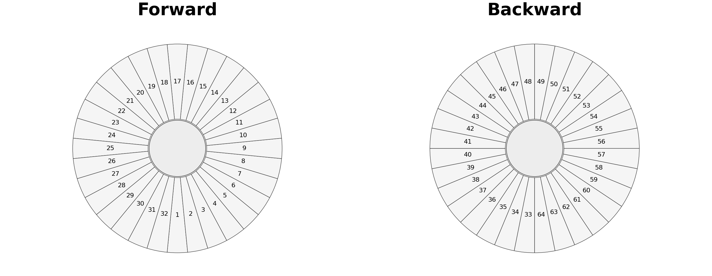
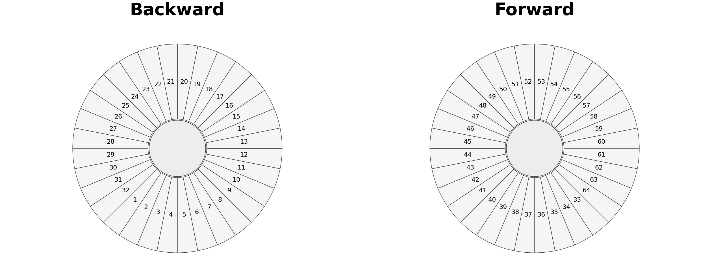

Detector Grouping and Layout
============================

Overview
--------

Asymmetry supports detector grouping for HiFi, MuSR, and EMU instruments.
Grouping is configured from the Grouping dialog and can be edited graphically
with the Detector Layout editor.

The grouping payload stores:

* detector groups (1-based detector IDs)
* group names
* selected forward/backward groups
* alpha and bin-range settings
* instrument and preset metadata
* optional per-detector ``t0`` metadata for formats such as PSI BIN/MDU and
  MusrRoot/LEM ROOT
* optional deadtime metadata: ``dead_time_us`` from file data and
  ``deadtime_method`` describing whether file values were applied
* optional background metadata: ``background_correction``,
  ``background_ranges``, ``background_values``, and ``background_method``

These settings are persisted in project files and in ``.grp`` files.

PSI Grouping
------------

PSI BIN/MDU files use the full Grouping dialog, matching the interaction model
used for raw ISIS NeXus files. Initial group names and forward/backward
defaults are derived from PSI detector labels where the file provides them
(``Forw``/``Back`` in BIN files, and labels such as ``F1``/``B1`` in MDU
files). This behavior follows the detector metadata exposed by musrfit's PSI
raw-data reader, with Mantid's PSI-BIN loader used as a cross-check for BIN
layout details.
When labels repeat, Asymmetry keeps one visible group per histogram and makes
the displayed names unique with numeric suffixes.

PSI data can carry a separate ``t0`` for each detector. Asymmetry stores these
values as ``detector_t0_bins`` and aligns each detector histogram to its own
``t0`` before summing groups. This avoids shifting all PSI spectra through a
single global time-zero before grouping.

ROOT Grouping
-------------

MusrRoot/LEM ROOT files also use the full Grouping dialog. The ROOT loader
follows musrfit's ``PRunDataHandler::ReadRootFile`` and reads detector labels
from ``DetectorInfo`` when available, falling back to the ROOT histogram title
or ``hDecay`` name. As with PSI BIN/MDU files, repeated detector labels are
kept as separate visible groups with numeric suffixes.

ROOT ``DetectorInfo`` entries can provide detector-specific ``Time Zero Bin``,
``First Good Bin``, and ``Last Good Bin`` values. Asymmetry stores these in the
grouping payload and aligns detector histograms by their own ``t0`` before
constructing the initial asymmetry.

Deadtime Correction
-------------------

The Grouping dialog includes a deadtime correction toggle for raw histogram
formats. It is enabled only when the reference run provides file deadtime
values, which is typically the ISIS/NeXus path. When enabled, Asymmetry applies
a non-paralyzable correction. If those file values are absent, no deadtime
fallback is estimated.

The file-value correction is the same form used by musrfit
``PRunBase::DeadTimeCorrection`` and Mantid ``ApplyDeadTimeCorr``:

.. math::

   N_\mathrm{corr} =
   \frac{N}{1 - N\,t_\mathrm{dead}/(\Delta t\,N_\mathrm{frames})}

For NeXus data, ``t_dead`` and ``N_frames`` come from the file when available.
For PSI BIN/MDU and MusrRoot/LEM ROOT data these NeXus-style constants are
normally absent, so the deadtime toggle is disabled and the background
correction path is used instead.

Background Correction
---------------------

The full Grouping dialog also includes a background correction toggle for
PSI-style raw histogram formats, including PSI BIN/MDU and PSI/LEM ROOT data.
This is separate from fit-model background parameters such as ``A_bg``: it
subtracts a count background from grouped raw forward/backward histograms
before the asymmetry is calculated.

This follows musrfit's ``PRunAsymmetry`` ordering. Histograms are first grouped
into forward and backward sums, then background is subtracted, and then
asymmetry is calculated. If grouping metadata provide fixed forward/backward
background values, those values are subtracted. Otherwise Asymmetry estimates
the background as the mean count in an inclusive bin range. If no range is
provided, it uses musrfit's fallback range from ``0.1 * t0`` to ``0.6 * t0``.

The correction is off by default and disabled for ISIS/NeXus data, where
deadtime correction is the file-metadata correction path. When enabled for PSI
data, the applied method, estimated values, and ranges are stored in the
grouping payload.

Detector Layout Editor Workflow
-------------------------------

1. Open Grouping from the toolbar or menu.
2. Click Detector Layout...
3. Choose instrument and preset in the right-hand panel.
4. Click detector sectors in the schematic to refine groups.
5. Apply and return to the Grouping dialog.

A detector can belong to multiple groups. This is required for transverse and
vector-polarization workflows.

In-App Arrangement Schematics
-----------------------------

HiFi
~~~~

   HiFi schematic matching the in-app detector arrangement.

MuSR
~~~~

   MuSR schematic matching the in-app detector arrangement.

EMU
~~~

.. figure:: images/emu-program-schematic.png
   :width: 90%
   :align: center
   :alt: EMU detector schematic generated from the program layout model.

   EMU schematic matching the in-app detector arrangement.

Related Topics
--------------

* :doc:`data_processing` for grouping and asymmetry APIs
* :doc:`gui_usage` for UI workflows
* :doc:`vector_polarization` for vector mode (P_x, P_y, P_z)
